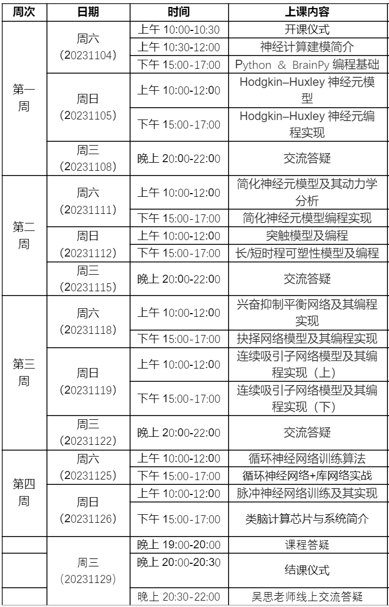

# Second Training Course on Neural Modeling and Programming (第二届神经计算建模及编程培训班)

## 一、培训班简介
神经计算建模是研究神经系统的结构、功能和机制的重要工具。通过数学、物理、计算机等工具，神经计算建模阐明了大脑工作的计算原理并推动了类脑智能的发展。为了普及这一方法，推动我国计算神经科学的人才培养，我们特别推出了《第二期神经计算建模及编程培训班》课程。

本课程由中国神经科学学会下属的《计算神经科学与神经工程专业委员会》发起，以北京大学神经信息处理课题组所著的《神经计算建模实战》教材为基础，结合BrainPy编程框架进行实践。你将学习神经计算的基本概念、方法和技术，如何用Python编程语言实现神经系统的建模和高效模拟。这将为你在神经计算和类脑智能领域的研究打下坚实的基础。同时，本期课程特别邀请了广东省智能科学与技术研究院类脑计算架构与超大规模处理系统研究组为大家讲解类脑计算芯片与系统，带领大家走进前沿的类脑芯片发展。

我们欢迎所有对神经计算建模感兴趣的老师和学生参加本期培训班，不论你来自哪个领域，我们坚信你将从中收获颇丰。

本期课程由和鲸HeyWhale社区提供免费的云平台算力支持。

## 二、培训安排

课程内容包括：

1.  神经计算建模简介

    - 神经计算的历史和发展
    
    - 神经计算建模的应用和简介

2.  神经元的电生理模型及动力学分析

    - 神经元的电生理模型介绍

    - 神经元动力学模型的分析

3.  突触动力学及其可塑性模型

    - 突触的生理机制介绍

   - 突触动力学模型及其可塑性机制

4.  神经网络的动力学及常见计算模型

    - 常见脉冲神经网络模型及实现

    - 常见发放率网络模型及实现

5.  AI在神经计算建模中的应用

    - AI在神经计算建模中的应用概述

    - AI在脉冲神经网络模型中的应用

6.  类脑芯片简介

具体日程安排如下：

我们期待的学员:

- 对神经科学、计算科学、人工智能等领域感兴趣的师生；

- 希望了解神经计算模型、类脑智能等前沿技术的专业人士；

- 有志于深入学习并掌握神经计算建模及编程的爱好者。

## 三、授课单位

本次培训班主要由「北京大学信息处理实验室」开展进行，授课老师由吴思教授及其课题组成员组成。由吴思教授领导的北京大学神经信息处理实验室隶属于北京大学心理与认知科学学院。该实验室的研究领域是计算认知神经科学和类脑计算。实验室与认知科学家、神经科学家、信息科学家等进行密切合作，用数理方法和计算机仿真来构建神经系统加工信息的计算模型，阐明大脑处理信息的一般性原理，并在此基础上发展类脑的人工智能算法。

本次培训班特别邀请广东智能科学研究院「类脑计算架构与超大规模处理系统课题组」讲授类脑计算系统与芯片。由环宇翔研究员领导的类脑计算架构与超大规模处理系统课题组面向类脑计算的硬件处理架构和超大规模类脑计算系统设计展开研究，旨在借鉴人脑的信息处理机制，设计具有神经拟态特性的专用处理内核、大规模的芯片互联架构与方法、以及面向全脑尺度千亿神经元规模超级计算系统。

## 四、培训时间和形式

培训时间：2023年11月04日-11月26日

培训方式：线上课程，基于腾讯会议进行授课。

微信链接：https://mp.weixin.qq.com/s/sObQ5EypmUuIv_4aCenzfw

报名链接：https://meeting.cns.org.cn/2ndNCMP/

